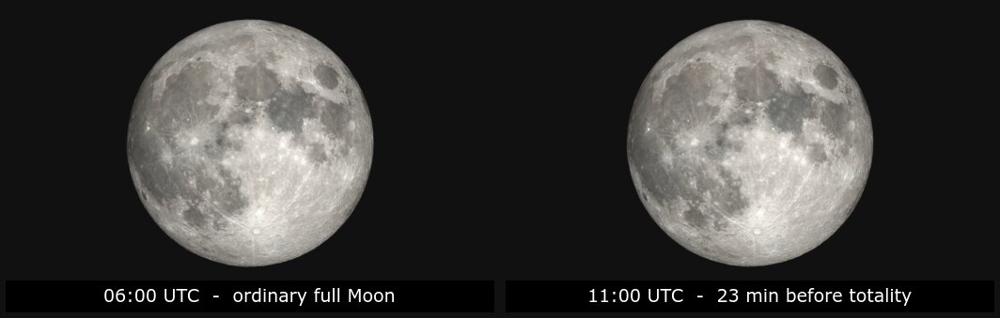
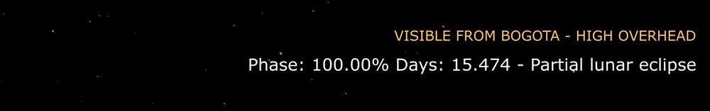
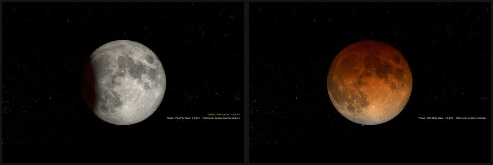

# moon-phase-background-windows

**[Design notes](README.md) · [Installation →](INSTALL.md)**

Your Windows desktop shows the Moon as it looks right now: NASA's hourly render
for the current UTC hour, composited on a star field and captioned with
illumination and cycle age.


```
$ moonback
Phase: 94.81% Days: 17.511

$ moonback                        # during the total eclipse of 2026-03-03
Phase: 100.00% Days: 13.999 - Total lunar eclipse (totality)
```

Roughly 250 lines of Python around one `magick` invocation and one
`SystemParametersInfoW` call. **This page is about why it is shaped the way it
is.** For setup, go to **[INSTALL.md](INSTALL.md)**.

---

## The one hard problem: which frame is "now"?

Everything else here is plumbing. The only real logic is mapping the current
moment onto one of NASA's 8,760 hourly frames, and it is deceptively easy to get
wrong — because when you do, nothing crashes. You get a beautiful,
correct-looking wallpaper of the wrong day.

NASA publishes `moon.0001.tif` … `moon.8760.tif`, where **frame *N* is hour
*N−1* of the year, in UTC**. So:

```python
index = (moment.astimezone(UTC).timetuple().tm_yday - 1) * 24 + moment.hour
frame = index + 1
```

Two things that version fixed, both silent in the original:

| Bug | Symptom |
|---|---|
| `tm_yday * 24` instead of `(tm_yday - 1) * 24` | Wallpaper showed **tomorrow's** Moon, all year |
| `datetime.now()` (naive, local) indexing UTC data | Wallpaper off by the machine's UTC offset |

Neither raises. Both render perfectly.

### So the data checks itself

The fix is not "write the formula more carefully" — it is to make the wrong
answer impossible to accept. NASA's table carries its own timestamps, so
[`select_hour`](moonback/moondata.py) computes an index and then **verifies the
row it landed on agrees**:

```python
row = rows[index]
if row.at != expected:
    raise MoonDataError(f"ephemeris row {index} is {row.at} but {expected} was requested")
```

That single comparison is what turns a silent class of bug into a loud one. It
is also why `data/` now holds NASA's verbatim `mooninfo_<year>.txt` instead of
two hand-edited columns of bare numbers: **the timestamps are the safety net,
and stripping them threw it away.**

The arithmetic lives in [`moonback/moondata.py`](moonback/moondata.py), which
touches no network, no disk and no clock. That is the whole reason it is a
separate module — see [Testing](#testing-what-actually-breaks).

---

## Design decisions

### Eclipses, because NASA's frames don't show them

During the total lunar eclipse of 2026-03-03, greatest at 11:34 UTC, this is
NASA's published frame for 11:00 — beside an ordinary frame from five hours
earlier:



They are indistinguishable. The Dial-A-Moon visualisation models phase and
libration, not Earth's shadow, so a wallpaper driven only by those frames goes
through totality showing a bland full disc and saying nothing about it. (There
is better imagery for the eclipse hours themselves — see
[below](#and-the-picture-changes-too) — but the caption is what carries it when
NASA has not rendered that particular eclipse.)

So the caption is the only signal there is, and it now carries one:

```
Phase: 100.00% Days: 13.999 - Total lunar eclipse (totality)
```

And if you told the installer roughly where you live, it also says whether you
can actually go outside and see it:



Four decisions worth naming:

- **A separate dataset, because the ephemeris has no eclipse column.** The 13
  columns of `mooninfo_<year>.txt` describe the Moon's geometry, not the
  Earth–Sun–Moon alignment. Eclipse times come from NASA/GSFC's Five Millennium
  Canon (Fred Espenak), scraped once into
  [`data/lunar_eclipses.txt`](data/lunar_eclipses.txt) — 45 events through 2040.
  Unlike the ephemeris this is not an annual chore: eclipse predictions are
  stable for centuries.
- **Totality is distinguished from the partial phase.** They differ by more than
  an hour and look completely different, so `Total lunar eclipse (totality)` and
  `Total lunar eclipse (partial phase)` are separate captions.
- **It is best-effort.** If the catalogue is missing or unparsable, the run logs
  a warning and captions without it. An optional adornment must never be able to
  stop the wallpaper updating.
- **"There is an eclipse" and "you can see it" are different claims.** The
  visibility line only appears when the Moon is above your horizon at the time,
  computed from the RA and Dec already in the ephemeris — see
  [Will you actually see it?](#will-you-actually-see-it) below.

### …and the picture changes too

The obvious next step is to tint the disc red. That would mean shipping invented
imagery under NASA's name, which is not a trade worth making for a nicer
screenshot — so instead, look harder for real data.

It exists. For major eclipses the SVS publishes a **separate telescopic
sequence** that does render Earth's shadow, in colour. While an eclipse is under
way the frame comes from there instead:



That is NASA's imagery, not a synthesis. Three things this needed:

- **A second, sparse table.** [`data/eclipse_views.txt`](data/eclipse_views.txt)
  maps an eclipse onto its SVS id and frame range. NASA only produces these for
  notable eclipses, usually months ahead, so most eclipses have no entry and
  fall back to the ordinary Moon plus the caption.
- **Cadence is derived, never assumed.** It is 10.000 s for the 2026 sequence
  and **7.723 s** for the 2025 one. Hard-coding a round number puts the 2025
  eclipse a whole phase out — verified by fetching both candidate frames for a
  known mid-totality instant and looking at them.
- **It is a choice.** The installer asks. Some people want one consistent view
  all year; the setting is `eclipse_imagery`.

The comparison above still stands for the other 8,750 hours of the year: the
Dial-A-Moon sequence never shows an eclipse, which is why the caption exists
even when the imagery is switched off.

One wrinkle worth recording: NASA's own table prints `2038 Dec 11 17:44:60` —
a rounding artefact that is not a valid time. The scraper normalises it by
adding the seconds as a delta; the parser stays strict, so the data file is the
contract.

### Will you actually see it?

A lunar eclipse is visible from roughly half the planet — whichever half has the
Moon above the horizon. Announcing one to the other half is just noise.

The tempting shortcut is NASA's own `"e Asia, Australia, Pacific, Americas"`
visibility string plus a country lookup table. I didn't, because the ephemeris
**already publishes the Moon's right ascension and declination for every hour**.
Given those and a latitude/longitude, altitude above the horizon is one line of
spherical trigonometry:

```python
sin(alt) = sin(dec)·sin(lat) + cos(dec)·cos(lat)·cos(hour_angle)
```

That is less code than the lookup table would have been, needs no new data
source, is pure and instantly testable — and it is far more precise than a
continent name. Concretely: NASA lists "Americas" for the total eclipse of
2026-03-03, but over Bogotá the Moon **sets during the partial phase**, so
Colombia sees the lead-up and misses totality entirely. A continent match would
have promised a show that never arrives.

Two honest limitations, both deliberate:

- The RA/Dec are geocentric, and refraction is ignored. Together those are worth
  under 1.5°, so anything within 3° of the horizon is reported as *"On the
  horizon — find a clear view"* rather than a confident yes or no.
- It is geometry, not meteorology. It cannot know about clouds.

The whole thing is validated against an oracle it cannot influence: for seven
cities across four continents, "is the Moon up" must agree with NASA's
independently published region list for that eclipse. It does.

### The caption asks Windows where the taskbar is

The original put the caption at a fixed offset that happened to clear a bottom
taskbar. On the machine this was developed on — 1440×900, 96 px taskbar — it
cleared by about 37 pixels. It was not broken; it was lucky. A thicker taskbar,
a side-docked one, or a taller screen aspect eats that margin, and nothing was
maintaining it.

So each run asks Windows via `SHAppBarMessage(ABM_GETTASKBARPOS)` which edge the
taskbar is docked to and how thick it is, and pushes the caption clear. Queried
per run, not at install time, because taskbars get moved and monitors get
plugged in.

The conversion is the only subtle part. The canvas is 3:2 and most screens are
not, so Windows "Fill" crops the top and bottom before displaying it — which
means screen pixels map to canvas pixels by the **width** ratio, the one Fill
preserves. Only a taskbar on one of the chosen corner's *own* edges can cover
the caption, so a bottom taskbar never shifts a top-corner caption sideways.

Which corner is a question at install time, because it is taste, not geometry.
The taskbar allowance then applies to whichever you picked. All of it is pure
arithmetic in [`layout.py`](moonback/layout.py); the one `ctypes` call lives in
`wallpaper.py` and degrades to plain margins if it fails.

### Every external call gets a timeout and a bounded retry

`svs.gsfc.nasa.gov` is a public NASA host doing us a favour, and it occasionally
stalls. Without a timeout, a scheduled run hangs until Task Scheduler's limit
kills it. Without a retry, one blip skips an hour.

So [`nasa.py`](moonback/nasa.py) sets explicit connect/read timeouts and retries
on a **bounded** budget, with three deliberate choices:

- **Full jitter**, not a fixed delay. Every installation of this tool fires on
  the hour. Fixed backoff would resynchronise all of them into a small
  thundering herd against a host that owes us nothing.
- **4xx is not retried.** A 404 means our frame arithmetic or the year's SVS
  collection id is wrong. Retrying can't fix that, and hammering NASA for it is
  rude. It fails immediately, saying which of the two to check.
- **`Retry-After` is honoured but capped** at 30s, so a confused header can't
  park a scheduled task for hours.

Downloads stream into a `.part` file and are `os.replace`'d into position only
on success — a truncated attempt can never leave a half-written TIFF for
ImageMagick to choke on, and a failed retry can't clobber a good frame.

### Failures name their own remedy

The original raised a bare `SystemError` and logged the exception object. In
practice every failure mode here has exactly one fix, so the error says it:

```
$ moonback
moonback: ImageMagick is required but 'magick' is not on PATH. Install it
(winget install ImageMagick.ImageMagick) and reopen your shell, or set
MOONBACK_MAGICK="C:\Program Files\ImageMagick-7.1.2-Q16-HDRI\magick.exe".
```

Two supporting rules:

- **Validate before doing work.** `load_config()` resolves ImageMagick and
  checks the ephemeris and canvas files exist *before* a 4 MB download, and
  exits `2`. Config errors and runtime errors are distinguishable by exit code.
- **Never swallow a subprocess's stderr.** ImageMagick's own message is the
  difference between "no such font" and "cannot write output"; it is captured
  and re-raised, not discarded.

`MOONBACK_MAGICK` exists because ImageMagick's installer does not always add
itself to PATH, and a scheduled task runs with a different environment than the
shell you tested in — the single most common way this tool breaks on someone
else's machine.

### One ImageMagick pass, not two

The original ran `magick composite` to place the Moon, then `magick convert` to
draw the caption — reading and rewriting a ~57 MB TIFF twice per run. It is one
invocation now.

Two smaller fixes rode along: `magick convert` is [removed in ImageMagick
7.1.1-33+](https://imagemagick.org/script/porting.php), and the caption moved
from `-draw "text 100,1200 '...'"` to `-annotate`, which takes the string as its
own argument instead of parsing it as a drawing program.

### The yearly rollover is configuration, not a code edit

NASA publishes a new visualisation each year under a new SVS id, so this tool
has a **hard annual expiry**. The original hardcoded 2025's URL and shipped
2025's data, which is why it was serving 404s by the time this was written.

That can't be designed away, but the annual work can be driven down to almost
nothing. It is split three ways by how much judgement each part needs:

```python
SVS_COLLECTIONS = {2025: 5415, 2026: 5587}   # the only thing a human decides
```

1. **The ephemeris fetches itself.** `data/mooninfo_<year>.txt` is a *cache*,
   not a shipped prerequisite: if it is absent, the run downloads it through the
   same timeout-and-retry path as everything else. So the first hourly run after
   midnight on 1 January self-heals. The Task Scheduler trigger that already
   exists is the only scheduler involved — no broker, no beat, no container.
2. **The id is discovered automatically.** A [GitHub
   Action](.github/workflows/year-rollover.yml) runs on 5 January, scrapes the
   SVS gallery, verifies the id actually serves frames, and opens a PR.
3. **A human merges it.** A scraped id is a guess. The verification catches a
   *dead* id, not a *wrong-but-live* one, so the PR is the checkpoint and
   nothing lands on `main` on its own.

If the automation is unavailable, an unmapped year still fails before any
download with the exact manual steps —
[INSTALL.md → Rolling over to a new year](INSTALL.md#rolling-over-to-a-new-year).

### The installer asks; it does not expect you to know

`is_big = True` in a source file was the original way to configure this. A
scheduled task cannot edit source, and environment variables are worse than they
look: a task runs in a different environment than the shell you tested in, which
is the single most common way this breaks on someone else's machine.

So `setup_environment.ps1` **detects what it can and asks about what it cannot
guess**, then writes the answers to `moonback.toml`:

```
When an hourly update fails, what should happen?
Failures happen: the laptop is offline, NASA is down, ImageMagick errors.
Either way the reason is always written to mbg.log.

  *1) Tell me something went wrong
       Task Scheduler's "Last Run Result" shows the failure, so you notice a
       tool that quietly stopped working.
   2) Keep the last wallpaper and say nothing
       A missed hour is invisible. Better on a laptop that is often offline -
       but a permanent breakage stays hidden too.
```

Three rules the prompts follow:

- **Never ask what you can detect.** ImageMagick is looked up on PATH, then in
  the usual install directories; you are only asked for a path if both fail.
- **State the cost of each answer, not just the label.** "Swallow the error" is
  a shrug; "a permanent breakage stays hidden too" is the actual trade-off.
- **Every prompt has a flag.** `-Unattended`, `-SizeProfile`, `-OnError`,
  `-LocationName`… so reinstalls and CI never need a human, and re-running
  interactively offers your previous answers as the defaults.

Environment variables still override the file, so a one-off experiment needs no
edit. `MOONBACK_*` remains the escape hatch; the file is the default path.

---

## Testing what actually breaks

The failure mode of this program is *plausible wrong output*, not a crash. So
the tests assert against things that are true independently of this codebase:

- The row for 2026-01-03 10:00 UTC is **>99.5% illuminated** — there is a full
  moon that morning. The row for 2026-01-18 20:00 UTC is **<0.5%** — new moon.
  Fail the index arithmetic and these fail, no matter how self-consistent the
  formula is.
- **Every row is reachable from its own timestamp**, walked across the real
  8,760-row table at a prime stride so every hour-of-day is hit.
- The old `tm_yday * 24` formula is [pinned as a regression
  test](tests/test_moondata.py) that shows it lands on a *real, plausible* row
  exactly one day late — demonstrating why the timestamp check has to exist.
- Boundaries that only bite twice a year: first and last hour of a year, leap
  years, a non-UTC offset that pushes the moment into the *previous* year, and
  naive datetimes (refused outright).

Eclipse annotation is tested the same way — against real events, not the
implementation. The 2026-03-03 eclipse is announced as *totality* at 12:00 UTC
and as the *partial phase* at 10:00, 11:00 and 13:00, because totality is 58
minutes wide and greatest is at 11:34. And a sweep of **every hour of 2026**
asserts that exactly two days are ever flagged: 3 March and 28 August. A caption
that cried eclipse on an ordinary night would be worse than one that stayed
quiet.

The download tests use `httpx.MockTransport` to cover the paths that only happen
when things go wrong: retries on 429/5xx and on four kinds of transport error,
no retry on 404, exhausting the budget, `Retry-After` clamping, no `.part` file
left behind, and a failed retry not clobbering a good file. `sleep` and `jitter`
are injected, so the retry suite is deterministic and runs instantly. The
fetch-on-miss path is covered too — including that a failed fetch leaves *no*
cache file, since a zero-byte one would poison every later run.

The horizon maths gets the strongest test in the repo, because it can be checked
against something it cannot influence: for seven cities on four continents,
"is the Moon above the horizon" is asserted to match NASA's independently
published visibility regions for the 2026-03-03 eclipse. Julian Date is pinned
to Meeus's worked examples.

The suite is grouped by what a failure tells you rather than by module, so
`-m astronomy` is the set to re-run after touching any coordinate or catalogue
maths:

```
$ uv run pytest
214 passed in 1.15s

$ uv run pytest -m astronomy
123 passed, 91 deselected

$ uv run pytest --splits 3 --group 2      # what CI runs, balanced by .test_durations
64 passed, 150 deselected
```

`.test_durations` is committed so the three CI shards stay balanced instead of
one taking three times as long as the others; regenerate it with
`uv run pytest --store-durations` when the suite grows lopsided.

Pure logic is a separate module precisely so all of this needs no network, no
ImageMagick, and no Windows — `moondata.py` imports nothing but the standard
library, and `ctypes.windll` is imported inside the one function that needs it.

---

## Known trade-offs

**The 57 MB elephant.** `back.tif` is a git-tracked 57 MB file that this tool
**rewrites every hour**. It is in `.gitignore` now, but git still tracks it
until you run:

```
git rm --cached back.tif
```

The blob remains in history; removing it needs a rewrite, which is not worth it
for a repo this size. Worth knowing before you `git clone` over a hotspot.

**No caching.** A ~4 MB frame is re-downloaded every hour even if nothing
changed, then deleted. Trivially fixable, but 4 MB/hour is below the threshold
where the added complexity pays for itself.

**Fixed caption geometry.** Offsets are per-profile constants tuned for the two
bundled canvases. A different canvas size needs new numbers.

**Windows only**, by definition — the last line calls `SystemParametersInfoW`.
Everything above it is portable, which is the point of the split, but nothing
else currently uses that.

---

## Layout

```
moonback/
  moondata.py   pure: parse the ephemeris, map "now" to a frame   <- the interesting part
  eclipses.py   pure: parse the eclipse catalogue, describe the hour
  eclipse_views.py  pure: map an eclipse hour onto NASA's telescopic render
  visibility.py pure: is the Moon above your horizon right now
  layout.py     pure: which corner the caption goes in, clear of the taskbar
  config.py     moonback.toml + env -> validated Config; fails before doing work
  nasa.py       download with timeout, bounded retry, atomic rename
  wallpaper.py  one magick pass; SystemParametersInfoW
  __main__.py   orchestration and exit codes
tests/          214 tests in 3 groups, no network, no ImageMagick, no Windows
data/           NASA mooninfo_<year>.txt (cached) and lunar_eclipses.txt
scripts/        one-off scrapers: eclipse catalogue, yearly rollover
.github/        the January rollover PR
```

## Credits

Adapted from [desertplant/moon-phase-background](https://github.com/desertplant/moon-phase-background)
(Linux Mint Cinnamon) for Windows.

Imagery from NASA's Scientific Visualization Studio,
[Moon Phase and Libration](https://svs.gsfc.nasa.gov/gallery/moonphase/) —
public domain, and genuinely remarkable work.
